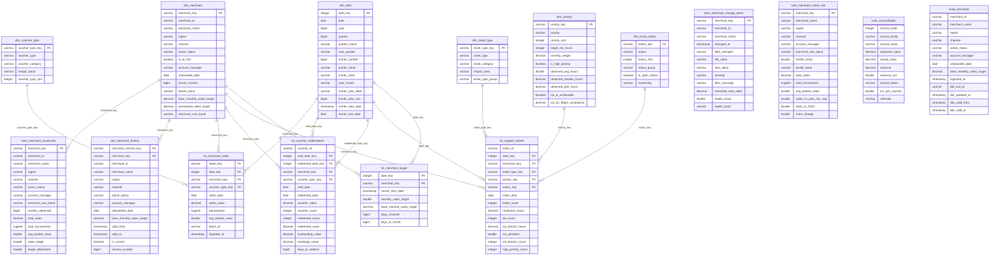

# Gold layer ERD

Derived from the `relationships` tests in the dbt manifest — every line below is an enforced test, not a drawing. If a join is dropped, the test disappears and so does the line.

```mermaid
erDiagram
    dim_merchant ||--o{ mart_merchant_scorecard : "merchant_key"
    dim_merchant ||--o{ dim_merchant_history : "merchant_key"
    dim_date ||--o{ fct_merchant_sales : "date_key"
    dim_merchant ||--o{ fct_merchant_sales : "merchant_key"
    dim_voucher_type ||--o{ fct_merchant_sales : "voucher_type_key"
    dim_date ||--o{ fct_voucher_redemptions : "sold_date_key"
    dim_date ||--o{ fct_voucher_redemptions : "redeemed_date_key"
    dim_merchant ||--o{ fct_voucher_redemptions : "merchant_key"
    dim_date ||--o{ fct_support_tickets : "date_key"
    dim_merchant ||--o{ fct_support_tickets : "merchant_key"
    dim_ticket_type ||--o{ fct_support_tickets : "ticket_type_key"
    dim_priority ||--o{ fct_support_tickets : "priority_key"
    dim_ticket_status ||--o{ fct_support_tickets : "status_key"
    dim_date ||--o{ fct_merchant_target : "date_key"
    dim_merchant ||--o{ fct_merchant_target : "merchant_key"
    dim_date {
        integer date_key PK
        date date
        bigint year
        bigint quarter
        varchar quarter_name
        varchar year_quarter
        bigint month_number
        varchar month_name
        varchar month_short
        varchar year_month
        varchar month_year_label
        bigint month_year_sort
        timestamp month_start_date
        date month_end_date
    }
    dim_merchant {
        varchar merchant_key PK
        varchar merchant_id
        varchar merchant_name
        varchar region
        varchar channel
        varchar active_status
        boolean is_at_risk
        varchar account_manager
        date onboarded_date
        bigint tenure_months
        varchar tenure_band
        decimal base_monthly_sales_target
        decimal annualised_sales_target
        varchar merchant_size_band
    }
    dim_merchant_history {
        varchar merchant_version_key PK
        varchar merchant_key PK
        varchar merchant_id
        varchar merchant_name
        varchar region
        varchar channel
        varchar active_status
        varchar account_manager
        date onboarded_date
        decimal base_monthly_sales_target
        timestamp valid_from
        timestamp valid_to
        boolean is_current
        bigint version_number
    }
    dim_priority {
        varchar priority_key PK
        varchar priority
        integer priority_sort
        integer target_sla_hours
        decimal severity_weight
        boolean is_high_priority
        double observed_avg_hours
        decimal observed_median_hours
        decimal observed_p90_hours
        boolean sla_is_achievable
        decimal sla_for_90pct_compliance
    }
    dim_ticket_status {
        varchar status_key FK
        varchar status
        integer status_sort
        varchar status_group
        boolean is_open_status
        varchar ownership
    }
    dim_ticket_type {
        varchar ticket_type_key PK
        varchar ticket_type
        varchar ticket_category
        varchar impact_area
        varchar ticket_type_group
    }
    dim_voucher_type {
        varchar voucher_type_key PK
        varchar voucher_type
        varchar voucher_category
        varchar margin_band
        integer voucher_type_sort
    }
    fct_merchant_sales {
        varchar sales_key FK
        integer date_key FK
        varchar merchant_key PK
        varchar voucher_type_key FK
        date sales_date
        decimal sales_value
        hugeint transactions
        double avg_basket_value
        varchar batch_id
        timestamp ingested_at
    }
    fct_merchant_target {
        integer date_key FK
        varchar merchant_key PK
        timestamp month_start_date
        double monthly_sales_target
        decimal base_monthly_sales_target
        bigint days_covered
        bigint days_in_month
    }
    fct_support_tickets {
        varchar ticket_id
        integer date_key FK
        varchar merchant_key FK
        varchar ticket_type_key FK
        varchar priority_key FK
        varchar status_key FK
        date ticket_date
        integer ticket_count
        decimal resolution_hours
        integer sla_hours
        decimal sla_breach_hours
        double sla_utilisation
        integer sla_breach_count
        integer high_priority_count
    }
    fct_voucher_redemptions {
        varchar voucher_id
        integer sold_date_key FK
        integer redeemed_date_key FK
        varchar merchant_key FK
        varchar voucher_type_key PK
        date sold_date
        date redeemed_date
        decimal voucher_value
        integer voucher_count
        integer redeemed_count
        decimal redeemed_value
        decimal outstanding_value
        decimal breakage_value
        bigint days_to_redeem
    }
    mart_merchant_change_alerts {
        varchar merchant_key PK
        varchar merchant_id
        varchar merchant_name
        timestamp changed_at
        varchar field_changed
        varchar old_value
        varchar new_value
        varchar severity
        varchar alert_message
        decimal merchant_total_sales
        double health_score
        varchar health_band
    }
    mart_merchant_scorecard {
        varchar merchant_key PK
        varchar merchant_id
        varchar merchant_name
        varchar region
        varchar channel
        varchar active_status
        varchar account_manager
        varchar merchant_size_band
        bigint months_observed
        decimal total_sales
        hugeint total_transactions
        double avg_basket_value
        double sales_target
        double target_attainment
    }
    mart_merchant_value_risk {
        varchar merchant_key PK
        varchar merchant_name
        varchar region
        varchar channel
        varchar account_manager
        varchar merchant_size_band
        double health_score
        varchar health_band
        decimal total_sales
        hugeint total_transactions
        double avg_basket_value
        double sales_vs_prior_3m_avg
        double last3_vs_first3
        double mom_change
    }
    mart_reconciliation {
        integer control_order
        varchar control_family
        varchar control_name
        decimal expected_value
        decimal actual_value
        decimal variance
        double variance_pct
        varchar control_status
        double txn_per_voucher
        varchar rationale
    }
    snap_merchant {
        varchar merchant_id
        varchar merchant_name
        varchar region
        varchar channel
        varchar active_status
        varchar account_manager
        date onboarded_date
        decimal base_monthly_sales_target
        timestamp ingested_at
        varchar dbt_scd_id
        timestamp dbt_updated_at
        timestamp dbt_valid_from
        timestamp dbt_valid_to
    }
```
